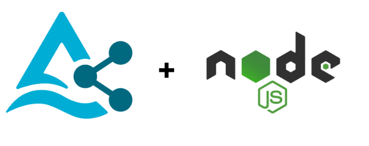

# Node.js Connector for Delta Sharing


## About
The Node.js Delta Sharing connector allows you to load shared datasets in Node.js as DataFrames using the popular library, [Danfo.js](https://danfo.jsdata.org/).

[Delta Sharing](https://delta.io/sharing) is an open protocol for secure real-time exchange of large datasets, which enables secure data sharing across different computing platforms. It lets organizations share access to existing [Delta Lake](https://delta.io) and [Apache Parquet](https://parquet.apache.org) tables with other organizations, who can then directly read the table in Pandas, Apache Spark, or any other software that implements the open protocol.

## Running the Sample Node.js Application

A sample Node.js application can be found in the project's GitHub [repo](https://github.com/goodwillpunning/nodejs-sharing-client) under the `/examples` directory. Simply link the Node.js package, install the dependencies, and execute the `app.js` file in your Node.js runtime environment. 

```bash
cd delta_sharing
npm link
cd ../examples
npm link install delta-sharing
node app.js
```
## System Requirements
 
The Node.js Delta Sharing connector requires **Node.js v16.9.0** or above.

## Reporting Issues

Found a bug or issue in the code? Please open a new issue under the [GitHub Issues](https://github.com/goodwillpunning/nodejs-sharing-client/issues) so we can track and fix community reported issues.

## Contributing 
Come join our team of contributors! We absolutely welcome all code contributions to Node.js Delta Sharing connector. Please see the [CONTRIBUTING.md](CONTRIBUTING.md) for more details.

## License
The Node.js Delta Sharing connector is free to download and use under the [Apache License 2.0](LICENSE.txt).
